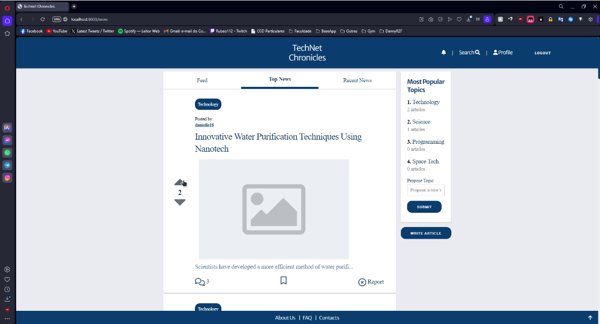

# TechNet Chronicles

> Information system with a web interface for a collaborative news management platform. The system stores information about the readers as well as the news submitted by users, including votes and comments. 

## Project Components

* [ER: Requirements Specification](https://git.fe.up.pt/lbaw/lbaw2324/lbaw2361/-/wikis/er)
* [EBD: Database Specification](https://git.fe.up.pt/lbaw/lbaw2324/lbaw2361/-/wikis/ebd)
* [EAP: Architecture Specification and Prototype](https://git.fe.up.pt/lbaw/lbaw2324/lbaw2361/-/wikis/eap)
* [PA: Product and Presentation](https://git.fe.up.pt/lbaw/lbaw2324/lbaw2361/-/wikis/pa)

## Artefacts Checklist

[Checklist](https://docs.google.com/spreadsheets/d/16EuvEu_C0aSzUT_u7cjNi6F6308TqNOUvH_YsgkcWDc/edit?usp=sharing)

## Product

Video Presentation : [Video Link](https://git.fe.up.pt/lbaw/lbaw2324/lbaw2361/-/blob/main/lbaw2361.mp4)

**Full Docker command to start the image available at the group's GitLab Container Registry using the production database:**

* composer install

* composer update

* docker run -it -p 8000:80 --name=lbaw2361 -e DB_DATABASE="lbaw2361" -e DB_SCHEMA="lbaw2361" -e DB_USERNAME="lbaw2361" -e DB_PASSWORD="XnhzWaCP" git.fe.up.pt:5050/lbaw/lbaw2324/lbaw2361 

*Note: unfortunately, we weren't able to test the image to the LBAW server. Thus, these are the commands to run the Website locally:* 

* git clone git@git.fe.up.pt:lbaw/lbaw2324/lbaw2361.git
* composer install
* composer update
* docker compose up -d 
* php artisan db:seed
* php artisan migrate
* php artisan serve

## Credentials

-Administration:

Username:user1@example.com   
Password:password_1

-User Credentials:

Username:user2@example.com   
Password:password_2

## Team

* João Pedro Sá Torres Neiva Passos, up202108833@up.pt
* Rúben Tiago Oliveira Silva, up202005334@up.pt
* Diogo Fernando Pinheiro Sousa, up202103341@up.pt
* André Gabriel Correia Vieira, up202004159@up.pt

***
GROUP2361, 20/09/2023
